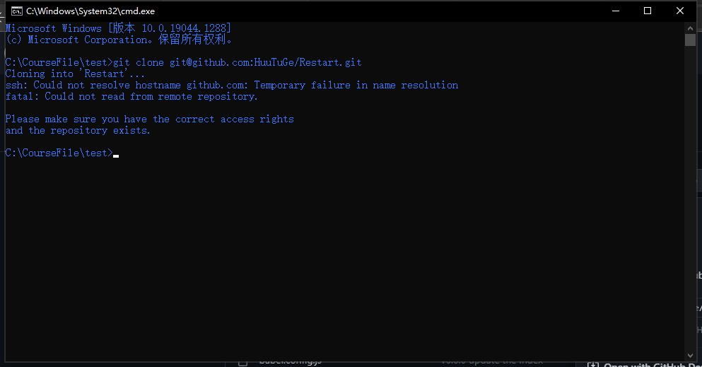
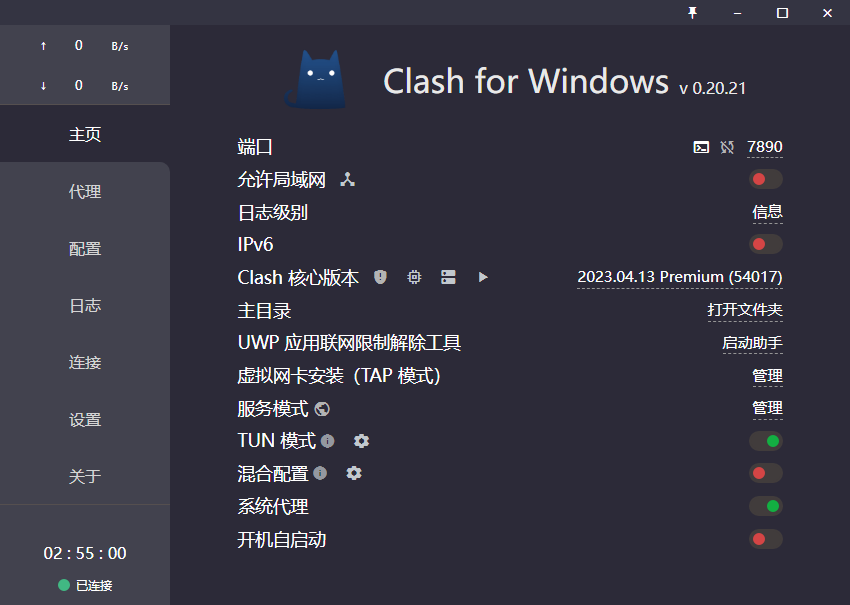

连接校园网时，经常遇到git push失败的问题，以为是要做代理才能解决，所以要尝试一下用clash为github做代理。



但是从截图来看，是出现了DNS域名解析的问题，看来是要主动设置一下DNS服务器

# 设置DNS服务器

使用百度和阿里的DNS服务器

```
# 阿里
223.5.5.5
# 百度
180.76.76.76
```

Windows 10按照以下步骤来配置DNS服务器：

1. 在Windows搜索框中输入“网络和共享中心”，打开网络和共享中心。
2. 点击“更改适配器设置”链接，打开网络连接窗口。
3. 找到您正在使用的网络连接，右键单击并选择“属性”。
4. 在弹出的窗口中，找到“Internet 协议版本 4 (TCP/IPv4)”并双击它。
5. 在弹出的窗口中，选择“使用下面的DNS服务器地址”并输入您想要使用的DNS服务器地址。
6. 点击“确定”保存更改。

更改完DNS服务器后，再ping一下，发现可以了。


# git代理配置

1、首先查看clash的主页，clash的默认端口号为7890.



2、设置git代理

使用命令`git config --global http.proxy http://127.0.0.1:7890`

# 命令行代理

1.给cmd设置代理(只能在当前终端生效)

输入以下命令：`set http_proxy=http://127.0.0.1:7890 & set https_proxy=http://127.0.0.1:7890`

2.给powershell设置代理（只能在当前终端生效）

输入以下命令：`$Env:http_proxy="http://127.0.0.1:7890";$Env:https_proxy="http://127.0.0.1:7890"`

# Reference

[国内常用的DNS服务器汇总 - 蓝点网 (landiannews.com)](https://www.landiannews.com/archives/21724.html)

[阿里公共DNS (alidns.com)](https://www.alidns.com/)

[百度DNS - 帮助中心 - 公共DNS (baidu.com)](https://dudns.baidu.com/)
